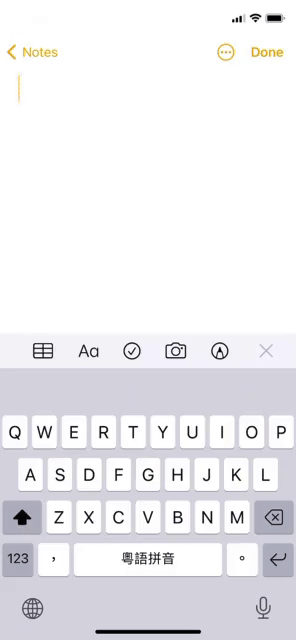

# Hong Kong Keyboard

This is a native iOS keyboard for Hong Kong Cantonese. It is an iOS frontend
to the excellent Google Input Tools service.

The project is built on
[KeyboardKit](https://github.com/danielsaidi/KeyboardKit). I would not have
taken this project on without it.

## Why?

[Google Input Tools](https://www.google.com/inputtools/) is extremely good at
Cantonese input. It picks the Cantonese phrases intelligently based on
context. It is a joy to use.

Unfortunately, the service is only available on Android, Chrome, or Windows.
The iOS Gboard does support Cantonese input, but it is not in the same league
as Google Input Tools. For example, when entering the phrase "neihoma" in
Gboard, it suggests "你可馬", instead of what Google Input Tools would suggest
correctly, which is "你好嗎".

I really wanted to be able to use Google Input Tools on my iOS device. So I
wrote my own iOS frontend for it.

## How does it work?

Hong Kong Keyboard makes a network call to Google Input Tools on every
keystroke. It sends the English characters you have typed so far, and the
Cantonese sentence you have typed in up to this point as context. The service
returns a list of suggestions, you pick from the suggestions, and rinse and
repeat.

The response from Google Input Tools is pretty fast. If the network is slow, you
will observe delayed response. It is unavoidable.

## How do I install it?

Sorry, this is not available on the Apple AppStore. It is too much hassle to go
through the review process. It is also unclear if the app could pass the review
process.

To install it, you have to build it in XCode and install it on your device.
XCode 12 works fine.
